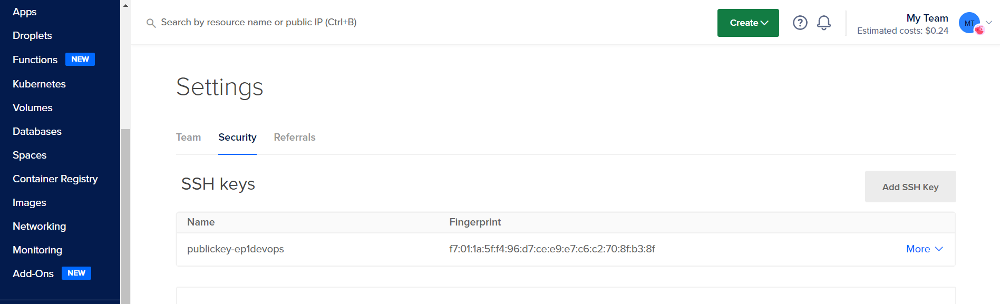

# Examen Parcial 1 - DevOps
 Fredy Alexander Rivera Monzón - 18001956
 Universidad Galileo 2022

## Indicaciones para ejercicio de Terraform
Para levantar el proyecto se recomienda utilizar un entorno de Linux. En mi caso, todo el proyecto de Terraform fue probado en una máquina virtual de Ubuntu Desktop 20.04 ejecutandose en VMWare Workstation.

### Requisitos para el proyecto de Terraform
* Entorno de Linux (Preferible Ubuntu Desktop 20.04 virtualizado en VMWare Workstation).
* Una cuenta activa en DigitalOcean con token disponible para realizar la conexión al proveedor de Cloud.
* En el entorno de Linux debe estar instalado Terraform y Ansible.

### Pasos para el despliegue del proyecto de Terraform
1. En la máquina virtual de Linux **ejecutar los siguientes comandos** para instalar Terraform y Ansible
```bash
frivera@ubuntu:~/Desktop$ sudo apt-get install terraform -y

frivera@ubuntu:~/Desktop$ sudo apt-get install ansible -y
```
Verificar que se haya instalado correctamente ambas aplicaciones.

2. Descargar la carpeta del proyecto del parcial y dirigirse al directorio de terraform. **Ejecutar el siguiente comando para dirigirse al directorio:**
```bash
frivera@ubuntu:~/Desktop$ cd ep1/terraform/
frivera@ubuntu:~/Desktop/ep1/terraform$ 
```
En la carpeta de terraform se podrá encontrar el archivo *main.tf* que es el archivo encargado del despligue utilzando terraform, un directorio llamado **provision** donde se encuentran los playbooks de ansible y un directorio llamado **sshkeypair** donde se encuentran el par de llaves públicas y privadas para autenticarse con los droplets que se crearán.

3. Ahora hay que proceder a inicializar terraform. En el mismo directorio terraform, **ejecutar el siguiente comando:**
```bash
frivera@ubuntu:~/Desktop/ep1/terraform$ terraform init
```
Luego que haya finalizado la inicialización de terraform, preparar su token de su cuenta de DigitalOcean.

4. A continuación se muestra la estructura del comando que se usará para realizar el *plan* y *apply* de terraform. Aún no ejecutar los comandos que se mostrarán.

El comando tiene la siguiente estructura
```bash
terraform [plan|apply] -var "do_token=your_dotoken" -var "pvt_key=private_key_location" -var "pub_key=public_key_location"
```

Ahora, se hará uso de las llaves que se encuentran en el directorio **sshkeypair** por lo que el comandó quedará así:

```bash
terraform [plan|apply] -var "do_token=your_dotoken" -var "pvt_key=sshkeypair/id_rsa" -var "pub_key=sshkeypair/id_rsa.pub"
```
Ahora, se hará uso de su token personal de su cuenta de DigitalOcean. Para fines demostrativos se usará un token dummy pero a la hora de ejecutar el comando debe quedar usar su token personal.

> dop_v1_EXAMPLEb8f85b081895f489921abbf26e64d7f3a0e581f8a1d8d532a5ba55e

Por lo que el comando finalmente debe quedar así:

```bash
terraform [plan|apply] -var "do_token=dop_v1_EXAMPLEb8f85b081895f489921abbf26e64d7f3a0e581f8a1d8d532a5ba55e" -var "pvt_key=sshkeypair/id_rsa" -var "pub_key=sshkeypair/id_rsa.pub"
```

5. Ya teniendo la estructura del comando, **ejecutar el siguiente comando para realizar el plan en terraform:**

```bash
frivera@ubuntu:~/Desktop/ep1/terraform$ terraform plan -var "do_token=dop_v1_EXAMPLEb8f85b081895f489921abbf26e64d7f3a0e581f8a1d8d532a5ba55e" -var "pvt_key=sshkeypair/id_rsa" -var "pub_key=sshkeypair/id_rsa.pub"
```

*Recordar que el token que se debe usar es su token personal*

6. Ahora se proceder a ejecutar el apply, **ejecutar el siguiente comando para realizar el apply:**

```bash
frivera@ubuntu:~/Desktop/ep1/terraform$ terraform apply -var "do_token=dop_v1_EXAMPLEb8f85b081895f489921abbf26e64d7f3a0e581f8a1d8d532a5ba55e" -var "pvt_key=sshkeypair/id_rsa" -var "pub_key=sshkeypair/id_rsa.pub"
```
*Recordar que el token que se debe usar es su token personal*

### Verificación del despliegue del proyecto
Todo lo que acontinuación se mostrará es en la pagina de DigitalOcean

* En el lateral izquierdo dirigirse a Settings > Security. En este apartado se ecuentra el recurso de SSH que se creó.



* En el lateral izquierdo dirigirse a Manage > Networking > VPC. Aquí se encontrará el VPC que se creó con el segmento de red que se configuró en terraform.


* En el lateral izquierdo, dirigirse a Manage > Droplets. Aquí se encontrarán los 2 servidores que se crearon. También se puede observar que cada droplet tiene dirección IP pública y direccionamiento IP privada en el segmento de red que se configuró en el VPC.


* Utilizando las IPs publicas de cada Droplet, se puede acceder al servicio que están ejecutando y observar que se instaló correctamente apache y nginx. También se puede observar un output en la parte inferior de la pagina web de ambos donde se muestra un ping realizado a la dirección IP privada confirmando así que hay comunicación entre los Droplets por medio de la VPC.


### Eliminando el proyecto

Para eliminar el despligue de la infreaestructura en DigitalOcean, **utilizar el siguiente comando:**

```bash
frivera@ubuntu:~/Desktop/ep1/terraform$ terraform apply -destroy -var "do_token=dop_v1_EXAMPLEb8f85b081895f489921abbf26e64d7f3a0e581f8a1d8d532a5ba55e" -var "pvt_key=sshkeypair/id_rsa" -var "pub_key=sshkeypair/id_rsa.pub"
```

*Recordar que el token que se debe usar es su token personal*

## Indicaciones para ejercicio de Vagrant
Para levantar el proyecto de Vagrant se recomienda utilizar un entorno de Windows. En mi caso, todo el proyecto de Vagrant fue probado en mi máquina que corre Windows 10.

### Requisitos para el proyecto de Vagrant
* Máquina con Windows 10 u 11 instalado.
* Tener Vagrant instalado en el dispositivo.
* Tener instalado VMWare Workstation Pro
* Tener instalado el complemento para utilizar VMWare Workstation como proveedor.

### Pasos para el despliegue del proyecto de Terraform
1. Instalar vagrant y el utility de VMWare Workstation con los enlaces que se muestras a continuación:

[Vagrant](https://www.vagrantup.com/downloads "Instalar Vagrant")

[Utility](https://www.vagrantup.com/vmware/downloads "Instalar Utility de VMWare")

2. En la carpeta del proyecto del examen parcial, dirigirse al directorio de vagrant.
```bash
C:\Users\fariv\Desktop\DevOps Tests\ep1>
cd vagrant
C:\Users\fariv\Desktop\DevOps Tests\ep1\vagrant>
```

Dentro de esta carpeta podrá encontrar el archivo  *Vagrantfile* que es el que contiene las configuraciones necesarias para realizar el despligue y provisionamiento de las máquinas virtuales. También encontrará un directorio llamado **join** que funciona como un shared mount entre el host y las dos máquinas virtuales con el fin de poder compartir el token que genera el la máquina virtual Manager de Docker Swarm y poder hacer join al cluster de la otra máquina virtual que funcionará como Worker. 

3. Una vez en el directorio, **ejecutar el siguiente comando:**
```bash
C:\Users\fariv\Desktop\DevOps Tests\ep1\vagrant> vagrant up --provider vmware_workstation
```
4. Las máquinas virtuales debieron haberse creado y ser provisionadas con la instlación de Docker junto con un despliegue de Docker Swarm con 1 Manager y 1 Worker.

### Verificación del despliegue del proyecto
* Abra una terminal adicional en la misma carpeta de vagrant y **corra el siguiente comando:**
```bash
C:\Users\fariv\Desktop\DevOps Tests\ep1\vagrant> vagrant ssh vm1
```
*Si la terminal le solicita ingresar una contraseña, el password es **vagrant***

* Una vez dentro de la máquina virtual, **ejecutar el siguiente comando:**
```bash
vagrant@vm1:~$ sudo docker node ls
```
El comando anterior sirve para listar los nodos que son parte del cluster donde se puede obsrevar que la vm1 donde usted está logeado es el Manager del cluster y la vm2 (que es la otra máquina virtual que se creó) es un worker del mismo cluster.


### Eliminando el proyecto
* Para eliminar el despliegue de las máquinas virtuales, **ejecutar el siguiente comando:**

```bash
C:\Users\fariv\Desktop\DevOps Tests\ep1\vagrant> vagrant halt
C:\Users\fariv\Desktop\DevOps Tests\ep1\vagrant> vagrant destroy
```